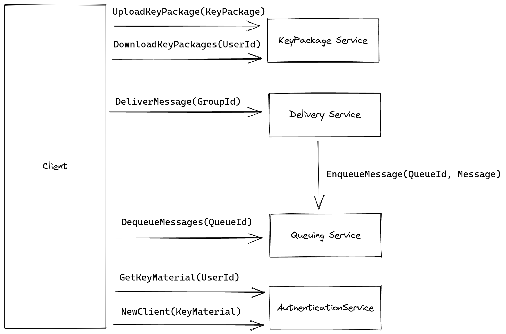
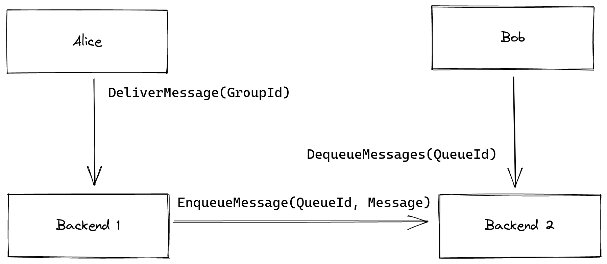

# Modularization and Architecture Overview

The requirements sketched above provide a good distribution of services across modules within the homeserver. Here, we provide a list of modules, as well as the functionality we expect them to provide to users and their clients.

## Modules

- Delivery service:
    - Initial creation of a group and management of the corresponding state (including addition and removal of members)
    - Message delivery to members of a given group
- Authentication service:
    - Registration of new users
    - Addition and removal of clients of a given user
    - User discovery
    - Authentication of users through their clients
- Queuing service:
    - Creation of queues for clients
    - Enqueuing of messages by the delivery service
    - Dequeuing of messages by the client owning the queue
- KeyPackage service:
    - Upload of KeyPackages
    - Retrieval of KeyPackages for a given client or user

## Architecture

The following shows a simplified interface between client and homeserver. Note, that for some of the security requirements (which we will detail in a later report), we might add one or more additional modules. For example, we will likely add a module that provides DDoS protection.

Simplified interface for client ↔ backend communication.

## Federated Architecture

We will later generalize the above architecture to work in a federated setting. The general principle here is that individual clients only ever communicate through their own homeserver, so if a client’s query is w.r.t. another client, user or group that exists on another backend, that query will be forwarded accordingly. The target client/user/group’s homeserver is implicit in the GroupId/UserId/QueueId in question.

Sketch of a message delivery from one client across two homeserver. Alice contacts her Delivery Service, which in turn contacts the Queuing Service of Backend 2. Finally, Bob can retrieve the message from his homeserver by contacting the Queuing Service.
