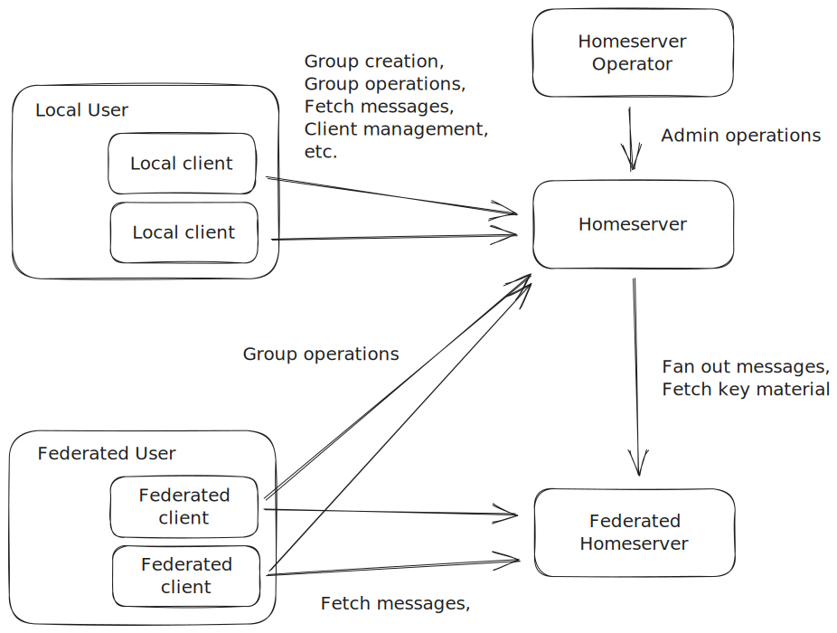

# Security requirements

This section iterates over each role and analyses each action as described in the [Methodology](./../methodology.md) section.

In addition to any specific security requirements listed in the individual actions, the following general security requirements must hold.

## Basic confidentiality and authentication

All actions performed via the network (which includes all actions with the possible exception those of the operator, which may be local, command-line based actions) MUST use be performed through a unilaterally authenticated TLS 1.3 connection using the home domain of the homeserver.

## Metadata minimalism

Metadata that is not required to provide functionality at a later point in time MUST be deleted immediately. Similarly, all metadata that is not required to be stored in the clear MUST be stored encrypted-at-rest.

## Architecture

The following figure illustrates the interactions of the individual roles.

.